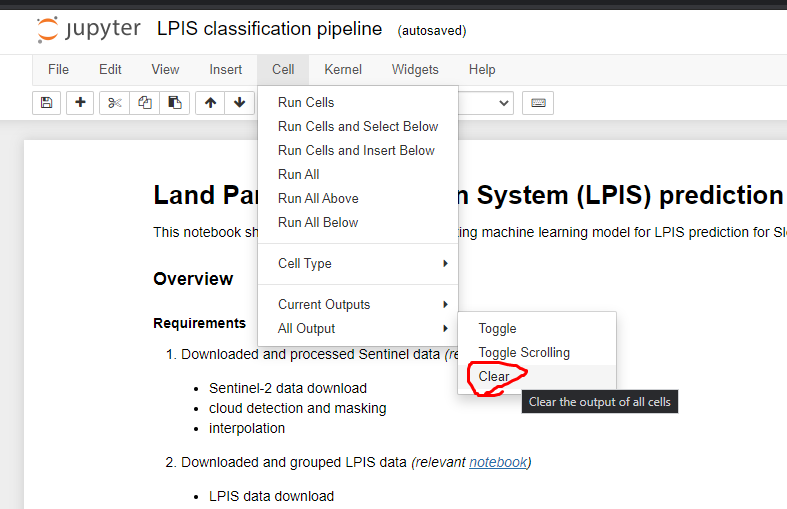

# Exploratory Analysis
Exploratory analysis of the Plooto's data sources.

## Use Cases and Basic Data Descriptions
* [Italian Use Case - Drones](docs/UC1-Drones.md) - [original data](https://maggiolispa.sharepoint.com/sites/PlootoHorizon/Documenti%20condivisi/Forms/AllItems.aspx?id=%2Fsites%2FPlootoHorizon%2FDocumenti%20condivisi%2FWP2%20%2D%20Supply%20chain%20DT%20modelling%20and%20operation%2FT2%2E4%20%2D%20Predictive%20Analytics%20and%20AI%20Services%2FItalian%20Pilot&viewid=e60a2162%2D2955%2D49c2%2D86f4%2D0aeb15c63b1b) - [our server](https://drive.google.com/file/d/11ZWaBpJHaZFoQTEXCWmd6dS6Pc8FwvHG/view?usp=sharing)

To download all the data and extract it to raw folder start the following:
```
cd src/data
python make_dataset.py
```

Data will be downloaded into `data/interim/` folder and unzipped to appropriate subfolders in `data/raw/`. If you make any additional dataset, you can save them in the `data/processed/` folder. External data, such as weather can be downloaded into `data/external/`.

## Work Organization

For the repository, we use the following [guidelines](https://drivendata.github.io/cookiecutter-data-science/). The following directory structure is encouraged:


```
├── README.md          <- The top-level README for developers using this project.
├── data
│   ├── external       <- Data from third party sources.
│   ├── interim        <- Intermediate data that has been transformed.
│   ├── processed      <- The final, canonical data sets for modeling.
│   └── raw            <- The original, immutable data dump.
│
├── docs               <- A default Sphinx project; see sphinx-doc.org for details
│
├── models             <- Trained and serialized models, model predictions, or model summaries
│
├── notebooks          <- Jupyter notebooks. Naming convention is described below.
│
├── references         <- Data dictionaries, manuals, and all other explanatory materials.
│
├── reports            <- Generated analysis as HTML, PDF, LaTeX, etc.
│   └── figures        <- Generated graphics and figures to be used in reporting
│
├── requirements.txt   <- The requirements file for reproducing the analysis environment, e.g.
│                         generated with `pip freeze > requirements.txt`
│
├── setup.py           <- Make this project pip installable with `pip install -e`
└── src                <- Source code for use in this project.
    ├── __init__.py    <- Makes src a Python module
    │
    ├── data           <- Scripts to download or generate data
    │   └── make_dataset.py
    │
    ├── features       <- Scripts to turn raw data into features for modeling
    │   └── build_features.py
    │
    ├── models         <- Scripts to train models and then use trained models to make
    │   │                 predictions
    │   ├── predict_model.py
    │   └── train_model.py
    │
    └── visualization  <- Scripts to create exploratory and results oriented visualizations
        └── visualize.py
```

### Organizing the Jupyter Notebooks

Every developer, since early development will be quite independent, should store his notebooks in a subfolder within the `notebooks/` (e. g. `notebooks/water-leakega-analysis`). Every developer is encouraged to use file structure similar to the following:

* `1.0-data_preparation.ipynb`
* `2.0-data_validation.ipynb`
* `3.0-exploratory_plotting.ipynb`
* `4.0-simple_linear_model.ipynb`
* `5.0-hierarchical_model.ipynb`
* `playground.ipynb`

Additionally you can use a subversion like:

* `1.1-data_preparation.ipynb`

### Always clear the cells before pushing

